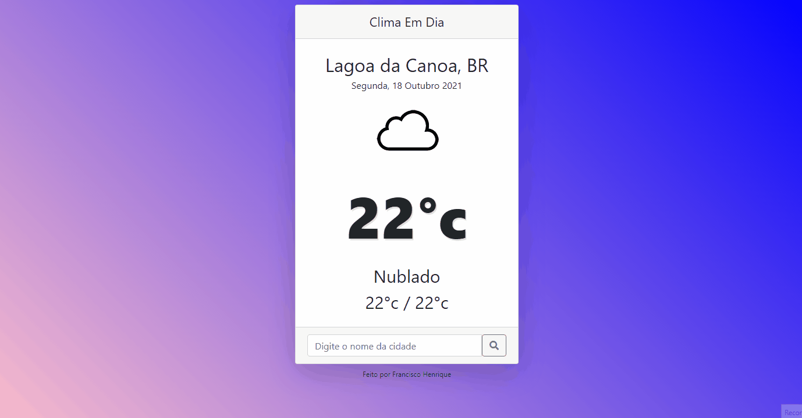

<h1 align="center">Projeto ClimaEmDia</h1> 
  
Aplicação que mostra o Clima/Temperatura

Trata-se de uma aplicação web consumindo e integrando uma API EXTERNa (OpenWeather), desenvolvido com uma base simples das seguintes tecnologias/linguagem: JavaScript, NodeJs, HTML, CSS  De acordo com sua localização geografica, ele mostra o clima no seu local, ou ainda pode mostrar clima de outros locais através da barra de pesquisa.  
Consumindo a API OpenWeather. 

<h1 align="center">
  
</h1>
<h2 align='center'> <a href="https://festive-mcnulty-3ebfc0.netlify.app/" target='_blank'>Link do Projeto</a></h2>

<h4 align="center"> 
	🚧  Projeto, para fins didáticos, está pronto 🚧
</h4>
  
